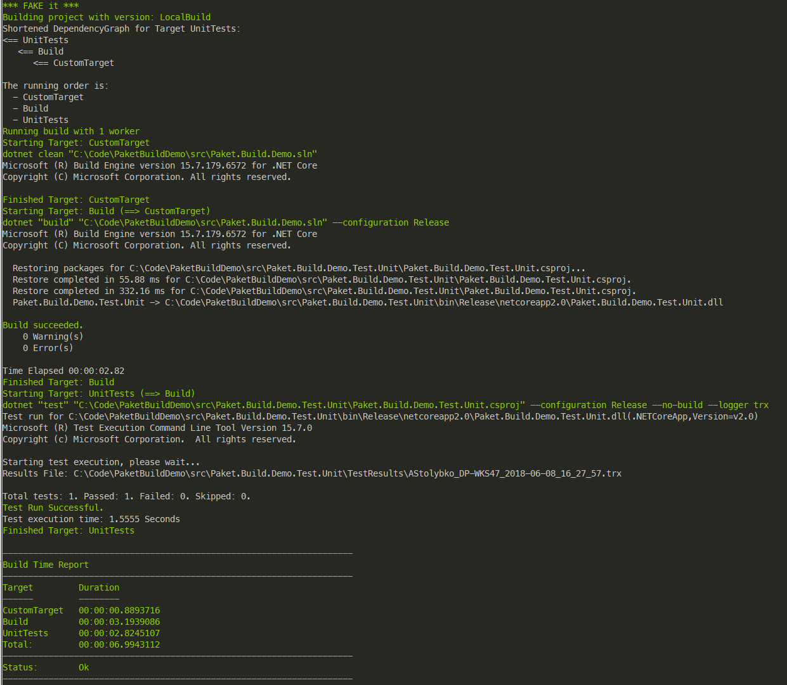
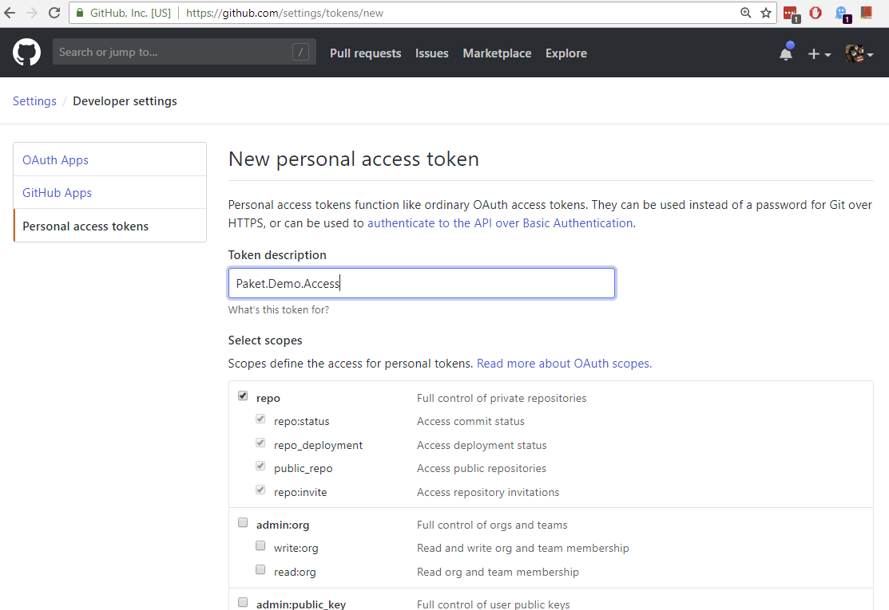

# PaketBuildDemo
- [PaketBuildDemo](#paketbuilddemo)
    - [Steps](#steps)
        - [Installing paket](#installing-paket)
        - [Define paket dependencies](#define-paket-dependencies)
        - [Create build script placeholder](#create-build-script-placeholder)
        - [Run the build script](#run-the-build-script)
    - [Custom build file](#custom-build-file)
        - [Create custom `build.fsx` file](#create-custom-buildfsx-file)
        - [Run the customized build](#run-the-customized-build)
    - [Git private repository](#git-private-repository)
        - [Getting Github personal access token](#getting-github-personal-access-token)
- [KNOWN PROBLEMS:](#known-problems)

An example of how to use Paket to use shared build files repo

## Steps

### Installing paket
//This step was omitted by adding an automatic download of paket from builds cript tempalte
NOTE: we are going to be using paket in a _magic_ mode. More details: https://fsprojects.github.io/Paket/bootstrapper.html

### Define paket dependencies
Paket relies on the file to exist in order to restore dependencies. The file has to be at a solution root (OPTIONALLY the whole Paket infrastructure can be placed into the `build` folder and be executed there as it was made in this demo)

```
mkdir build
touch build/paket.dependencies
```

Reference fake and a desired custom build scripts in the newly created file (_NOTE: for the purpose of this demo a new repository with build scripts was created at: `https://github.com/ninjaboy/build-scripts-poc`_):

``` paket
source https://api.nuget.org/v3/index.json

nuget FAKE ~> 4.64

github ninjaboy/build-scripts-poc:master build.fsx
github ninjaboy/build-scripts-poc:master build-runner.fsx

```

We are goin to use FAKE tool to run our build files and we are referencing 2 fsharp buildfiles that we will be using as our default builds cripts

### Create build script placeholder

Create a simple build script that basically will run `paket` tool, which will restore our dependencies and then will execute `fake` passing referenced default `build-runner.fsx` as a build script with some set of predefined parameters like `Runtime`, `Configuration`, `SolutionName`, etc (See the referenced `build.fsx` for more details)

``` bash
mkdir build
cd build
touch build.ps1
```

Copy the reference build file from `build-scripts-poc` repository named `build.ps1` into your `build` directory.

### Run the build script
In it's simplest for the build script can be run as follows `.\build\build.ps1` which will run `FullBuild` target or specify the target to run `.\build\build.ps1 -target UnitTests`

This should build the solution and run `dotnet test` for the unit tests projects:


## Custom build file
Now we may want to define our custom targets to do steps specific to our project that are different from what is proposed by default build files we are referencing

Here's how to achieve this:

### Create custom `build.fsx` file
In this example please follow to the `build-custom` directory for the examples

Note that new `build.ps1` file is now referring to the custom FAKE file:
`$buildScript=[System.IO.Path]::Combine($buildDir, "build-custom.fsx" )`

Note that the new `build-custom.fsx` file defines a new target dependency `CustomTarget` for a `build` target

### Run the customized build
Run the build as follows:
`.\build-custom\build.ps1 -target UnitTests`

You will see that the newly defined target was taken into account when building dependencies list:


## Git private repository
It is highly likely that the shared build scripts may need to be kept in the private repository
As a part of this POC task the private repository has been created: `https://github.com/ninjaboy/build-scripts-poc-private`

Please follow to the `build-private` folder
In order for Paket to be able to access this repository an access key has to be specified.

### Getting Github personal access token
In order to allow Paket to access a certain private repository files the following steps need to be done

1. Login to the Github in Github from the account that owns private build scripts repository
2. Follow to `Account Settings -> Developer Settings -> Personal Access Tokens -> Generate New Token`
3. Choose `Full control of private repositories`. As we are talking about private repository access it seems (at least at the moment of writing this document) that you need to issue a token with full access to private github repositories for the account that is hosting build scripts repository. See the image below

4. Copy the generated token and make sure to not lose it as you wont be able to see it's value next time

5. Run the following command (from the root of this repository copy) on the machine which is intended to run build (e.g. your dev machine, build agent, etc): `.\build-private\.paket\paket.exe config add-token github-token 1aXXXXXXXXXXXXXXXXXXXXXXc7` (the last parameter is the value of the issued personal access token that you have generated in step 4)
2. Change `paket.dependencies` file to reflect access to private repositories, e.g. `github ninjaboy/build-scripts-poc-private:master build.fsx github-token` (See folder `build-private` of this repository for more details)
NOTE: any name can be used instead of `github-token` but make sure that this name is used in `paket.dependencies` file

# KNOWN PROBLEMS: 

No problems detected so far